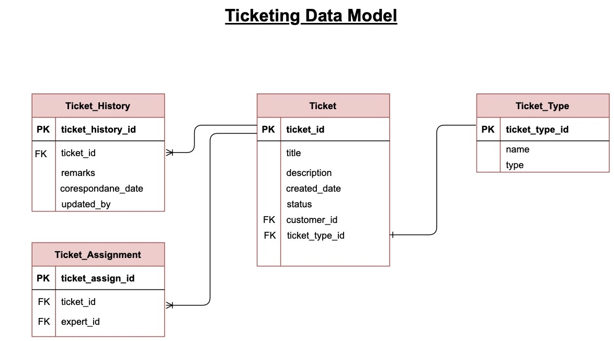
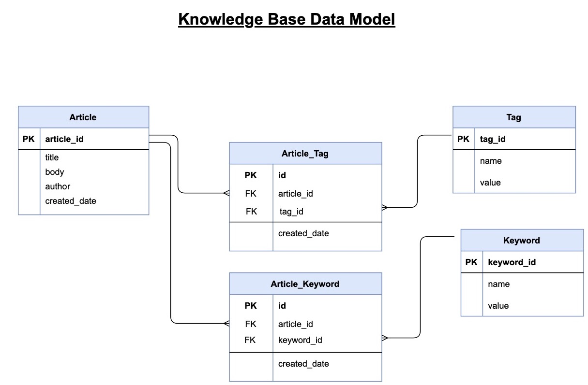

# Sequence Diagrams
In the Sysop Ecosystem Multiple actors interact with the system to achieve required functionalities. Broadly there are two different workflow streams which happen in Sysop.  The sequence diagrams worked as a reference for defining our  data workflow and service communication in Distributed Architecture model. It has been ensured that our evolutionary architecture have required coupling in the migration of monolith to distributed.

## Ticketing Workflow

 
Ticketing  workflow steam defines how customers interact with the system for ticket creation and how Sysop Experts and Sysop IT system facilitates the ticket routing, ticket maintenance  and ticket completion. The sequence diagram captured all synchronous and asynchronous message communications that happen in the workflow.

## None-Ticketing Workflow

Non Ticketing workflow defines how Customers interact with the system for support plan , billing  and how the system provides the information. The workflow also defined the business backend operation (reporting etc) required for smooth operation. 

# Data Models

## SysOps Data Model

SysOps Data Model contains entities and their relationships related to user and survey management components

SysOps User has a profile
- A customer can be a SysOps User
- An expert can be a SysOps User
- A administrator/manager can be a SysOps User based on Profile role
- An expert is associated with a expert profile
- A customer can have multiple contracts
- Billing is based on Customer contract
- Payment has a Payment Method
- Payment is associated with Billing
- A survey has a survey template
- A survey contains multiple questions
- A survey is  associated with a customer
- Survey responses stored in customer_survey_respones

## Ticketing Data Model

Ticketing Data Model contains entities and their relationships related to Ticketing component.

- A Ticket has a ticket type
- A ticket is associated with a Customer
- A ticket is assigned to an expert
- Ticket History contains all ticket related correspondences.

## Knowledge Base Data Model
Knowledge Data Model contains entities and their relationships related to Knowledge Base component.

- An article is associated with multiple tags
- A tag can  be associated with multiple articles
- An article is associated with multiple keywords
- A keyword can  be associated with multiple articles

