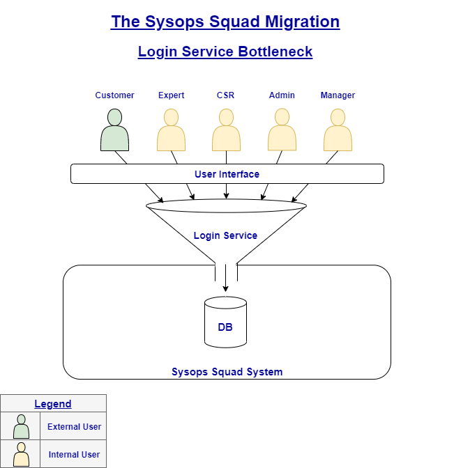
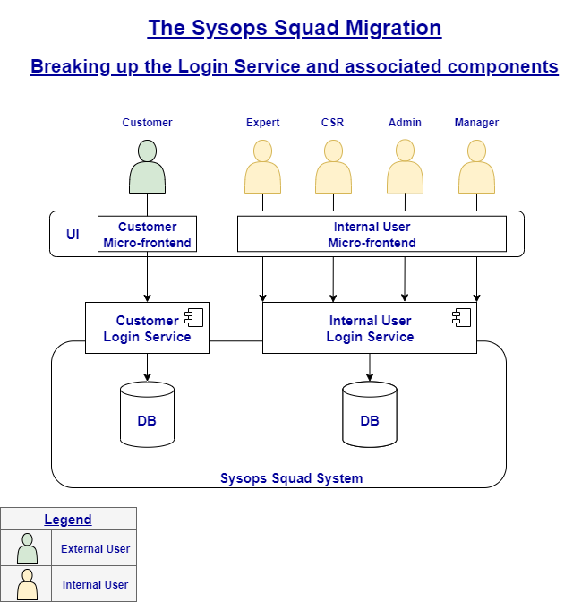

### **ADR_005-00**:

### Breaking up the Login Service and associated components

**<u>Status</u>**:	Proposed

**<u>Context</u>**: In the existing system, all SysOps users (external viz Customers, and internal viz Experts, CSRs, Admins & Managers) are funneled through a single "Login" component. This can be a bottleneck, especially during a spike when -

1. Customers are logging in to create tickets (or check status of their existing tickets)
2. Experts need to login to close tickets
3. CSRs are getting calls from customers to create tickets over the phone because the UI is not responding
4. Managers are logging in to generate reports
5. Administrators are logging in to check performance of the system, because apparently it is not responding :)

Besides, the system availability requirements for a Customer are very different from other users of the system.

**<u>Decision</u>**:

To eliminate the aforementioned bottle neck and to make the system more available for the Customer (and hence, improve UX), it has been decided to break down the login service to serve Customers (external users) and all others (internal users) separately.

As a result, we will now have a "Customer Login Service" and a "Internal User Login Service".

**<u>Consequences</u>**:

As a ripple affect of this decision, we have -

- Two separate micro-frontends for the two different login services catering to different category of users
- Customer Login Service along with the Customer Profile are grouped together and get a DB of their own
- Internal User Login Service along with the Expert Profile & User Maintenance components get to share their own DB

