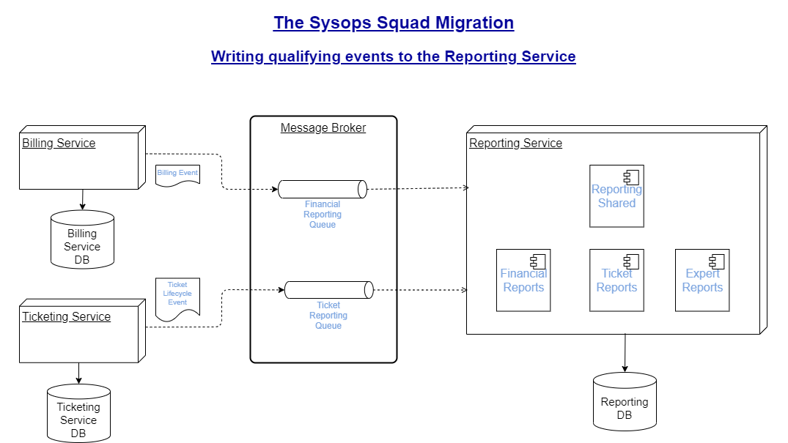

### **ADR_006-00**:

### Data for Reporting Service

**<u>Status</u>**:	Proposed

**<u>Context</u>**: In the existing system, all data is collected in a common DB and hence the reporting component can reference this shared data source for it's reports. However, per our [migration strategy](adr_003-00_MigrationStrategy.md), the data needed for various reports will now be spread across multiple different data stores and depriving the reporting service of the previous luxury.

The options we have are to either,

1. Have the reporting service query the respective services to collect the data periodically
2. Connect to the data store of various different services to read the data as needed
3. Sync data (periodically, or at real time) from various data stores to the reporting datastore
4. All events that qualify to be reported be written into reporting specific queues by various services

**<u>Decision</u>**:

While all of the aforementioned options will solve the reporting service's dilemma, we found that each of them came with a few limitations.

***With option 1***, there is a possibility of the queried service being down or busy servicing transactional requests. And the additional query from the reporting service can cause a degree of performance overhead.

***With option 2 & option 3***, we run into the risk of tightly coupling the reporting service with the data model of other services. Any changes to the data model in other services will cause the reporting service change (or break) as well.

***With option 4***, we need to setup additional queues for each service that generates qualifying events to write into them. Additional setup will be needed when new services are introduced in the system.

We decided to go with option 4 because it reduced runtime overhead (from option 1) and did not have tight coupling between services (from option 2 & 3), at the cost of having additional queues in our message broker.

**<u>Consequences</u>**:

Additional queues need to be setup and written to, to allow reporting service to have the data it needs.

