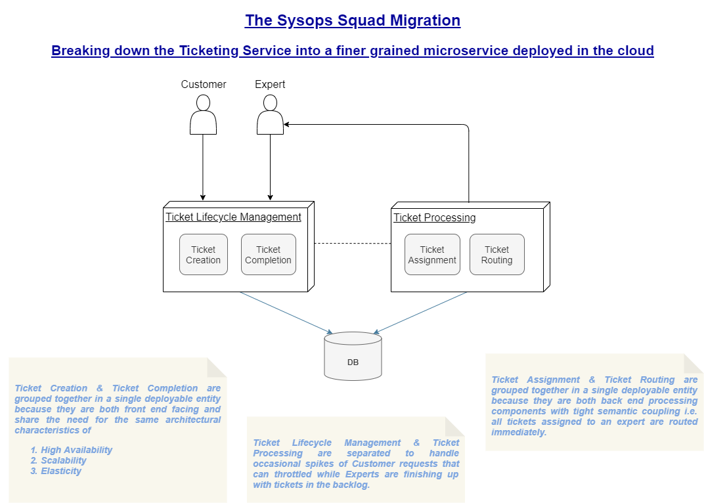

### **ADR_007-00**:

### Decomposing the Ticketing Service

**<u>Status</u>**:	Proposed

**<u>Context</u>**: In the Sysops Squad system, among all of the various services and components, (in our opinion) the one with the most business impact is the ticketing service. It requires to be highly available, recoverable, agile, scalable, reliable and elastic, more than any other service. Hence, the ticketing service has been chosen to be our candidate to be decomposed into a finer grained microservice.

The ticketing service has four major components - 

- Ticket Creation
- Ticket Assignment
- Ticket Routing
- Ticket Completion

A decision needs to be made in terms of the granularity of the microservice. We have the option of -

1. Having each of the components into it's own microservice
2. Bundling components based on shared characteristics and common business semantics

**<u>Decision</u>**:

While option 1 does provide us with finer granularity, it also comes with the additional overhead of managing parallel processes for similar components and operational overhead along with inter-service communication that can be avoided by intelligently bundling them.

We decided to bundle Ticket Creation & Ticket Completion components together (as a "Ticket Lifecycle Management" microservice) since both of them are front facing and share the characteristics of needing high availability, scalability and elasticity.

Likewise, Ticket Assignment & Ticket Routing are bundled together as a single "Ticket Processing" microservice.

**<u>Consequences</u>**:

Both the bundled microservices identified here will share a common DB and communicate asynchronously over a dedicated queue in the message broker, where the ticketing workflow will be defined.

We also recognized that this microservice will be a good candidate to be hosted on the cloud that inherently addresses the need for the ticketing services' defining characteristics mentioned above.

